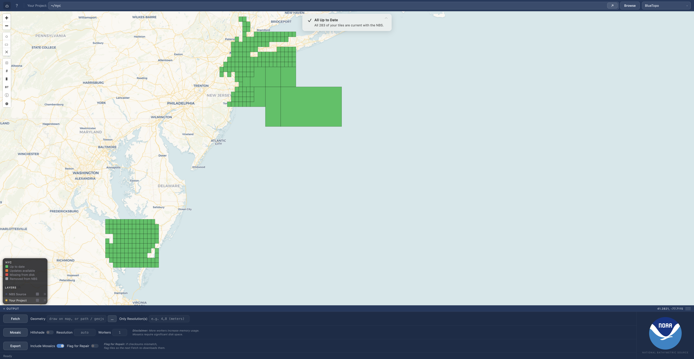

<h1 align="center">NOAA Bathymetry UI</h1>

Get the latest and best public bathymetry.

## Overview

Browser-based interface for the [noaabathymetry](https://github.com/noaa-ocs-hydrography/noaabathymetry) Python package. Explore NBS data on an interactive map, fetch tiles in your area of interest, build mosaics, and export your project as a portable zip.

See the [documentation](https://noaa-ocs-hydrography.github.io/noaabathymetry-ui/) for more details.

## Download

| Platform | Link |
|----------|------|
| macOS (Apple Silicon) | [Download](https://github.com/noaa-ocs-hydrography/noaabathymetry-ui/releases/latest/download/noaabathymetry-macOS-ARM.zip) |
| macOS (Intel) | [Download](https://github.com/noaa-ocs-hydrography/noaabathymetry-ui/releases/latest/download/noaabathymetry-macOS-Intel.zip) |
| Windows | [Download](https://github.com/noaa-ocs-hydrography/noaabathymetry-ui/releases/latest/download/noaabathymetry.exe) |

No installation or Python environment required. Just download and run.

## Background

NOAA's [National Bathymetric Source](https://nauticalcharts.noaa.gov/learn/nbs.html) builds and publishes the best available high-resolution bathymetric data of U.S. waters. The program's workflow is designed for continuous throughput, ensuring the best bathymetric data is always available to professionals and the public. This data provides depth measurements nationwide, along with vertical uncertainty estimates and information on the originating survey source. It is available in multiple formats (GeoTIFF compilations like [BlueTopo](https://www.nauticalcharts.noaa.gov/data/bluetopo.html) and Modeling, BAG, and IHO S-102) hosted on a public S3 bucket.

## License

[CC0-1.0](LICENSE)

## Disclaimer

This repository is a scientific product and is not official communication of the National Oceanic and Atmospheric Administration, or the United States Department of Commerce. All NOAA GitHub project code is provided on an 'as is' basis and the user assumes responsibility for its use. Any claims against the Department of Commerce or Department of Commerce bureaus stemming from the use of this GitHub project will be governed by all applicable Federal law. Any reference to specific commercial products, processes, or services by service mark, trademark, manufacturer, or otherwise, does not constitute or imply their endorsement, recommendation or favoring by the Department of Commerce. The Department of Commerce seal and logo, or the seal and logo of a DOC bureau, shall not be used in any manner to imply endorsement of any commercial product or activity by DOC or the United States Government.
